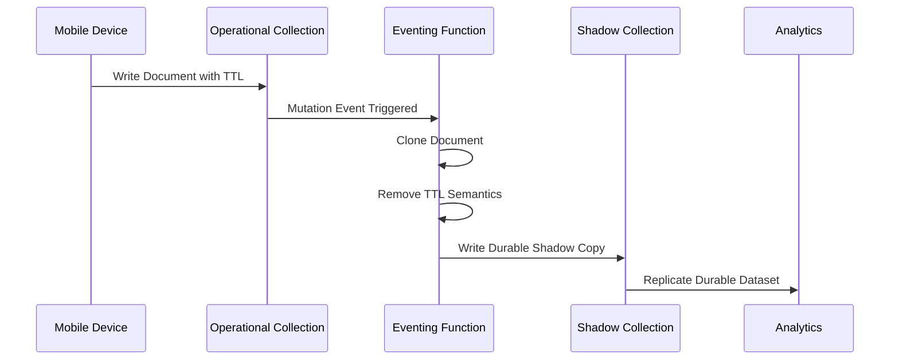

# Couchbase Eventing Shadow Collection Pattern

### Real-Time TTL Isolation for Durable Analytics & Reporting

---

# 📘 Overview

This project demonstrates a production-oriented architectural pattern using Couchbase Eventing to decouple operational TTL-based data lifecycle management from long-term analytics retention requirements.

The solution was designed for environments where:

* Mobile devices continuously generate operational events
* Documents are written with aggressive TTL policies
* Operational indexes experience rapid growth
* Analytics platforms require durable historical retention
* Real-time reporting is required without batch ETL pipelines

The architecture introduces a **shadow collection pattern** that strips TTL semantics from operational documents before replication into Analytics.

This allows operational collections to remain lightweight and self-cleaning while preserving durable historical datasets for reporting and BI workloads.

---

# 🧠 Use Case

Operational mobile workloads often use TTL (Time-To-Live) to automatically expire transient or short-lived data.

This is highly effective for:

* controlling storage growth
* reducing operational index size
* maintaining fast transactional performance
* minimizing data management overhead

However, when TTL-enabled documents are replicated into Analytics:

* expiration metadata propagates downstream
* historical records expire automatically
* analytical datasets become incomplete
* reporting windows continuously shrink
* long-range trend analysis becomes unreliable

The customer required:

* real-time operational ingestion
* automatic operational cleanup via TTL
* long-term historical analytics retention
* stable reporting datasets
* elimination of batch ETL infrastructure

These requirements created a conflict between:

* operational lifecycle management
* analytical retention requirements

---

# ⚠️ The Core Problem

Without architectural isolation:

```text
Operational TTL → Analytics TTL → Historical Data Loss
```

Because Analytics inherits the same expiration semantics, documents disappear from analytical datasets once TTL expires.

This results in:

* incomplete KPI reporting
* inconsistent dashboards
* unreliable historical analysis
* loss of analytical fidelity over time

---

# 🪞 Shadow Collection Solution

To solve this problem, Couchbase Eventing is used as a lightweight real-time transformation layer.

The Eventing pipeline:

1. Captures operational mutations in real time
2. Creates a deep copy of incoming documents
3. Removes operational TTL semantics
4. Writes a durable copy into a shadow collection
5. Uses the shadow collection as the Analytics replication source

This creates a durable analytics-ready dataset independent of operational retention policies.

---

# 🏗️ High-Level Architecture


---

# 🔄 Event Processing Flow



---

# 📊 Architecture Benefits

| Capability                 | Benefit                                   |
| -------------------------- | ----------------------------------------- |
| TTL Isolation              | Prevents analytics data expiration        |
| Real-Time Processing       | Eliminates batch ETL latency              |
| Operational Decoupling     | Protects production workloads             |
| Historical Retention       | Enables durable reporting datasets        |
| Lightweight Transformation | No external processing framework required |
| Analytics Stability        | Prevents shrinking reporting windows      |

---

# ⚙️ Eventing Responsibilities

The Eventing function performs three major responsibilities:

## 1. Validation Layer

Protects the pipeline from:

* malformed documents
* recursive mutations
* invalid event structures
* internal Eventing loops

---

## 2. Shadow Write Layer

Creates:

* analytics-safe copies
* durable non-expiring datasets
* lineage-aware transformed records

---

## 3. Aggregation Layer

Maintains:

* real-time event counters
* lightweight operational metrics
* analytics-ready summary documents

---

# 📦 Example Documents

## Incoming Operational Document (TTL Enabled)

```json
{
  "eventType": "ORDER_CREATED",
  "deviceId": "mobile-1022",
  "amount": 149.99,
  "ttl": 86400
}
```

---

## Shadow Collection Version (TTL Removed)

```json
{
  "eventType": "ORDER_CREATED",
  "deviceId": "mobile-1022",
  "amount": 149.99,
  "_source": "eventing"
}
```

---

# 🪵 Observability

The Eventing pipeline emits structured operational logs including:

* EVENT_RECEIVED
* SHADOW_WRITTEN
* COUNTER_WRITTEN
* DROP_INVALID_DOC
* COUNTER_FAIL

This supports:

* operational troubleshooting
* replay analysis
* throughput monitoring
* transformation validation

---

# 🚀 Why This Pattern Works

This architecture allows organizations to:

* maintain aggressive operational TTL policies
* preserve durable analytical datasets
* eliminate batch ETL pipelines
* maintain near real-time analytics synchronization
* scale analytics independently from operational workloads

The shadow collection becomes the durable analytical source of truth while operational collections remain optimized for mobile ingestion and transactional performance.

---

# 📂 Recommended Repository Structure

```text
couchbase-eventing-shadow-analytics/
│
├── README.md
├── docs/
├── eventing/
├── diagrams/
├── examples/
├── scripts/
└── assets/
```

---

# 🔮 Future Enhancements

This pattern can be extended into:

* Kafka event streaming
* AI/LLM enrichment pipelines
* Vector embedding generation
* Real-time dashboarding
* Replayable event sourcing architectures
* Operational anomaly detection

---

# 📌 Summary

This project demonstrates how Couchbase Eventing can be used as a lightweight real-time transformation and durability layer between operational mobile workloads and analytical reporting systems.

By introducing a shadow collection:

* operational TTL policies remain intact
* analytics datasets remain durable
* historical reporting becomes reliable
* external ETL pipelines are eliminated
* real-time synchronization is preserved

The result is a scalable event-driven analytics architecture optimized for both operational efficiency and long-term reporting requirements.
